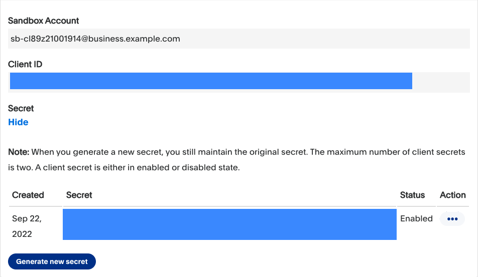

  
   
  <a href="https://twitter.com/paypaldev" target="_blank">Twitter</a>
    &nbsp;&nbsp;-&nbsp;&nbsp;
  <a href="https://www.paypal.com/us/home" target="_blank">PayPal</a>
    &nbsp;&nbsp;-&nbsp;&nbsp;
  <a href="https://developer.paypal.com/home" target="_blank">Docs</a>
    &nbsp;&nbsp;-&nbsp;&nbsp;
  <a href="https://github.com/paypaldev" target="_blank">Code Samples</a>
    &nbsp;&nbsp;-&nbsp;&nbsp;
  <a href="https://dev.to/paypaldeveloper" target="_blank">Blog</a>
   
  

# PayPal JS
This repository contains pre-built examples to help you explore PayPal services and integrate them in your applications.

Refer to [PayPal Developer](https://developer.paypal.com/home) for more info.

**Starndard Checkout**

**Advanced Checkout**

---
### Using the examples

The examples require a client ID and secret.

Complete the steps in [Get started](https://developer.paypal.com/api/rest/) to get the following sandbox account information from the Developer Dashboard:
- Sandbox client ID and the secret of [a REST app](https://www.paypal.com/signin?returnUri=https%3A%2F%2Fdeveloper.paypal.com%2Fdeveloper%2Fapplications&_ga=1.252581760.841672670.1664266268).

When launching an example, select the *Codespaces Settings* and update the secrets with your cilent ID and secret.

## PayPal Developer Community
The PayPal Developer community helps you build your career while improving your products and the developer experience. You’ll be able to contribute code and documentation, meet new people and learn from the open-source community.
 
* Website: [developer.paypal.com](https://developer.paypal.com)
* Twitter: [@paypaldev](https://twitter.com/paypaldev)
* GitHub:  [@paypal](https://github.com/paypal)
